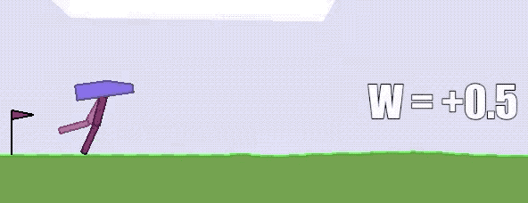

## Weight Agnostic Neural Networks at NeurIPS 2019!

Our paper '_Weight Agnostic Neural Networks_' was accepted for a **Spotlight** presentation at **NeurIPS** 2019!!! Check out the [interactive article](https://weightagnostic.github.io/), [Google AI blog post](https://ai.googleblog.com/2019/08/exploring-weight-agnostic-neural.html), [twitter discussion](https://mobile.twitter.com/hardmaru/status/1138600152048910336), and [code release](https://github.com/google/brain-tokyo-workshop/tree/master/WANNRelease)!
